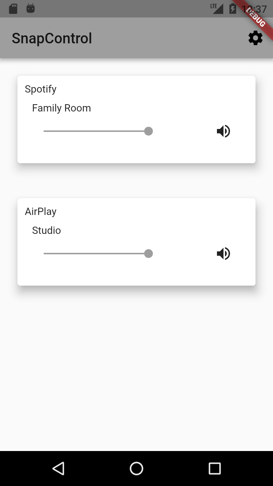
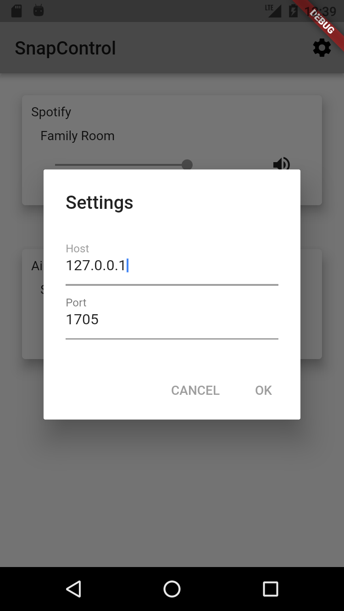

# snapcontrol

A [Snapcast](https://github.com/badaix/snapcast) controller application built using [Flutter](https://flutter.io/)

- It is intended to only control a Snapserver, streaming audio is not supported

# Screenshots

